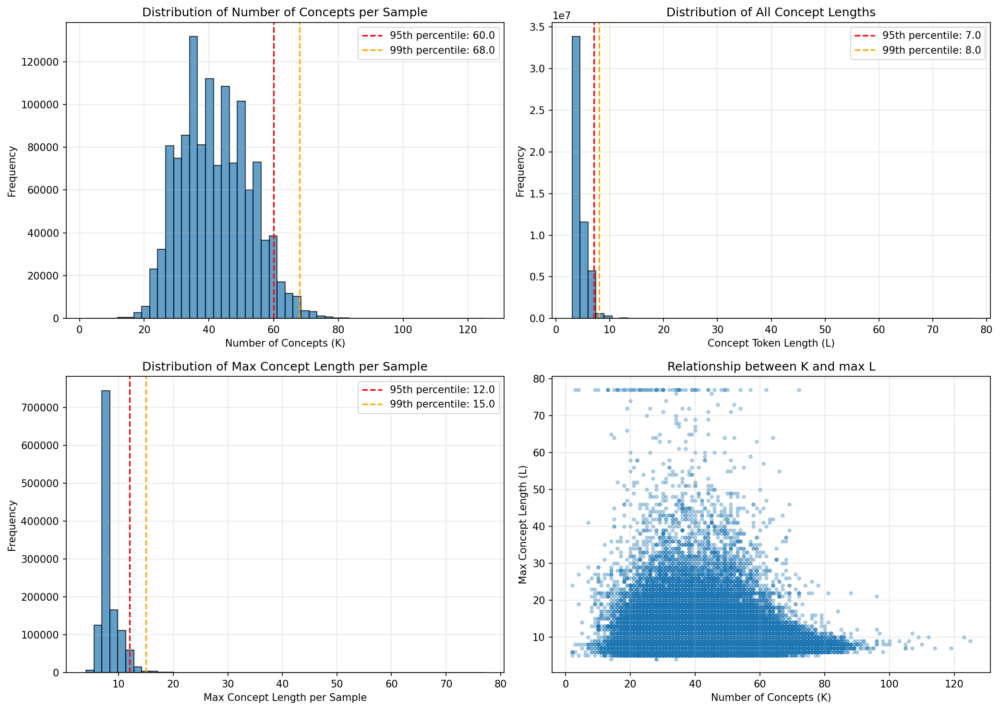

## Data

This project uses a filtered subset of the **ShareGPT4V** dataset, a large-scale vision-language dataset containing detailed image descriptions and multi-modal conversations.

  **Download Data**:
- LAION-CC-SBU-558K: [images.zip](https://huggingface.co/datasets/liuhaotian/LLaVA-Pretrain/blob/main/images.zip)
- COCO: [train2017](http://images.cocodataset.org/zips/train2017.zip)
- SAM: [images](https://ai.meta.com/datasets/segment-anything-downloads/). We use 000000~000050.tar. The links are provided in [sam.txt](data/ShareGPT4V/data/sam/sam.txt)

   **Download Scripts**:
   For the LAION-CC-SBU-558K and COCO images:
   ```bash
   bash download_sharegpt4v.sh
   ```
   For the SAM images (this may take a few hours):
   ```bash
   bash download_sam.sh
   ```

   We provide the [data/ShareGPT4V/annotations/share-captioner_coco_lcs_sam_1246k_1107_filtered.json](https://drive.google.com/file/d/1rZiGWyiNbI4gJu4xm_chv8chHFw9KJif/view?usp=drive_link) for the filtered data, which is filtered using **[Detoxify](https://pypi.org/project/detoxify/)** with a threshold 0.1 and **[FalconsAI](https://huggingface.co/Falconsai/nsfw_image_detection)** with a threshold of 0.5.

  **Dataset Structure**:
   After downloading, the dataset should be organized as follows:
   ```
   data/ShareGPT4V/
   ├── annotations/
   │   └── share-captioner_coco_lcs_sam_1246k_1107_filtered.json
   ├── data/sam/                    
   │   └── images/
   ├── data/coco/                    
   │   └── train2017/
   └── data/llava/
       └── llava_pretrain/
           └── images/
   ```

   In the configs, ensure that the `--metadata` and `root` are setup correctly:
   - **Metadata file**: `data/ShareGPT4V/data/sharegpt4v/share-captioner_coco_lcs_sam_1246k_1107_filtered.json`
   - **Image root directory**: `data/ShareGPT4V/data`
   
   The metadata file contains JSON entries with image paths and associated captions/conversations.

   During training, the SpaCY extractor will extract phrases for each long caption.
   See `sharegpt4v_statistics_phrases.txt` and `sharegpt4v_statistics_phrases.png` for detailed statistics about the phrases extracted using SpaCY.

  Here are some key statistics for the extracted phrases. In our experiments, we evalaute up to 30 phrases with a max context-length of 30.
  <a href="" alt="">
    </a> -->
   